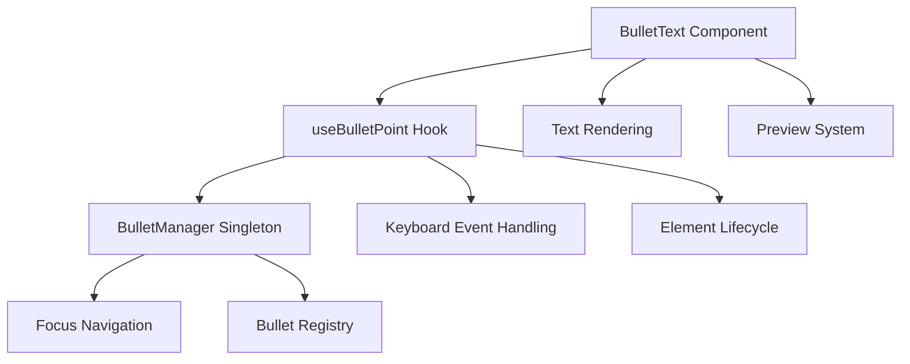

# Bullet Point System Architecture

This document describes the internal architecture, design decisions, and implementation details of the Bullet Point System.

## Design Philosophy

The Bullet Point System follows these core principles:

### 1. Single Responsibility Principle
Each component has a clear, single purpose:
- **BulletManager**: Manages global bullet state and navigation
- **useBulletPoint**: Handles individual bullet behavior and lifecycle
- **BulletText**: Provides React component interface

### 2. Zero Magic Policy
All behavior is explicit and predictable:
- No hidden state mutations
- No implicit DOM manipulations
- Clear cause-and-effect relationships

### 3. Declarative API Design
Components are configured through props, not imperative calls:
- State is passed down through props
- Changes bubble up through callbacks
- No direct component method calls

### 4. Performance First
Optimized for minimal overhead:
- Single global manager instance
- Efficient Map-based lookups
- Minimal DOM queries and mutations

## Core Architecture



## Component Breakdown

### BulletManager (Singleton)

**Responsibilities:**
- Central registry for all active bullet points
- Group-based organization and navigation
- Focus management across bullet groups

**Data Structures:**
```typescript
interface BulletGroup {
  id: string;
  bullets: Map<number, BulletPoint>;
}

class BulletManager {
  private groups = new Map<string, BulletGroup>();
}
```

**Key Methods:**
- `register(bullet)`: Add bullet to registry
- `unregister(groupId, index)`: Remove bullet from registry
- `focusNext(groupId, index)`: Navigate to next bullet
- `focusPrevious(groupId, index)`: Navigate to previous bullet

**Design Decisions:**
- **Singleton Pattern**: Ensures single source of truth for all bullets
- **Map-based Storage**: O(1) lookup performance for bullet access
- **Group Organization**: Logical separation of bullet collections

### useBulletPoint Hook

**Responsibilities:**
- Individual bullet point lifecycle management
- Keyboard event handling and interpretation
- Auto-registration with BulletManager
- DOM element management

**Key Features:**
```typescript
const {
  elementRef,        // React ref for the DOM element
  handleKeyDown,     // Keyboard event handler
  handleInput,       // Text input handler
  focusElement,      // Programmatic focus function
  isEmpty,           // Check if bullet is empty
  isCaretAtStart,    // Check cursor position
  isCaretAtEnd       // Check cursor position
} = useBulletPoint(options);
```

**Event Flow:**
1. Component mounts → Auto-register with BulletManager
2. User types → `handleInput` → `onChange` callback
3. User presses Enter → `handleKeyDown` → `onAddBullet` → Focus management
4. User presses Backspace on empty → `handleKeyDown` → `onRemoveBullet` → Focus management
5. Component unmounts → Auto-unregister from BulletManager

**Design Decisions:**
- **React Hook Pattern**: Natural integration with React lifecycle
- **Auto-registration**: No manual setup required
- **Event Delegation**: Centralized keyboard handling logic

### BulletText Component

**Responsibilities:**
- React component interface for bullet points
- Integration with existing preview/highlight system
- DOM rendering and styling

**Props Interface:**
```typescript
interface BulletTextProps {
  // Core functionality
  text: string;
  groupId: string;
  index: number;
  
  // Callbacks
  onChange?: (text: string) => void;
  onAddBullet?: () => void;
  onRemoveBullet?: () => void;
  
  // Preview system (legacy compatibility)
  highlightType?: 'set' | 'insert';
  previewOriginal?: string;
  previewReplaceWith?: string;
  
  // Styling
  className?: string;
}
```

**Design Decisions:**
- **Minimal Props**: Only essential props are required
- **Callback Pattern**: Changes bubble up through callbacks
- **Legacy Compatibility**: Maintains existing preview functionality
- **Styling Flexibility**: Supports custom CSS classes

## State Management

### Registration Flow

```typescript
// 1. Component mounts
useEffect(() => {
  const bulletPoint: BulletPoint = {
    id: `${groupId}-${index}`,
    groupId,
    index,
    element: elementRef.current,
    isEmpty: () => !element.innerText.trim(),
    focus: (position) => focusElement(position)
  };
  
  BulletManager.register(bulletPoint);
  
  // 2. Component unmounts
  return () => {
    BulletManager.unregister(groupId, index);
  };
}, [groupId, index]);
```

### Focus Management

```typescript
// Navigation logic
focusNext(groupId: string, currentIndex: number): boolean {
  const group = this.groups.get(groupId);
  if (!group) return false;
  
  const nextBullet = group.bullets.get(currentIndex + 1);
  if (nextBullet) {
    nextBullet.focus('start');
    return true;
  }
  
  return false;
}
```

**Key Features:**
- **Automatic Cleanup**: No memory leaks from stale references
- **Predictable Navigation**: Simple index-based focus management
- **Group Isolation**: Bullets only navigate within their group

## Event Handling

### Keyboard Event Processing

```typescript
const handleKeyDown = useCallback((e: React.KeyboardEvent) => {
  if (e.key === 'Enter') {
    if (isCaretAtEnd()) {
      // Create new bullet
      e.preventDefault();
      onAddBullet?.();
      
      // Focus new bullet after DOM update
      setTimeout(() => {
        BulletManager.focusNext(groupId, index);
      }, 50);
    }
    // Allow default behavior for line breaks in middle
    return;
  }
  
  if (e.key === 'Backspace' && isEmpty()) {
    // Delete empty bullet
    e.preventDefault();
    
    // Focus previous bullet first
    const moved = BulletManager.focusPrevious(groupId, index);
    
    // Then trigger deletion
    if (moved) {
      onRemoveBullet?.();
    }
  }
}, [groupId, index, isCaretAtEnd, isEmpty, onAddBullet, onRemoveBullet]);
```

**Design Decisions:**
- **Event Prevention**: Only prevent default when necessary
- **Timing Control**: Delays ensure DOM updates complete
- **Condition Checking**: Behavior depends on cursor position and content
- **Graceful Degradation**: Falls back to default behavior when appropriate

## Performance Optimizations

### 1. Efficient Data Structures
```typescript
// O(1) access to bullets by group and index
private groups = new Map<string, BulletGroup>();

interface BulletGroup {
  id: string;
  bullets: Map<number, BulletPoint>; // O(1) index lookup
}
```

### 2. Minimal DOM Queries
```typescript
// Direct element reference instead of DOM queries
const bulletPoint: BulletPoint = {
  element: elementRef.current, // Direct reference
  focus: (position) => {
    element.focus(); // No querySelector needed
    // ... cursor positioning
  }
};
```

### 3. Event Handler Optimization
```typescript
// Memoized event handlers to prevent unnecessary re-renders
const handleKeyDown = useCallback((e) => {
  // Event handling logic
}, [groupId, index, onAddBullet, onRemoveBullet]);
```

### 4. Automatic Cleanup
```typescript
// Prevent memory leaks with automatic cleanup
useEffect(() => {
  // Registration logic
  
  return () => {
    BulletManager.unregister(groupId, index);
  };
}, [groupId, index]);
```

## Error Handling

### Defensive Programming
```typescript
// Safe navigation with fallbacks
focusNext(groupId: string, currentIndex: number): boolean {
  const group = this.groups.get(groupId);
  if (!group) return false; // Group doesn't exist
  
  const nextBullet = group.bullets.get(currentIndex + 1);
  if (!nextBullet) return false; // No next bullet
  
  try {
    nextBullet.focus('start');
    return true;
  } catch (error) {
    console.warn('Failed to focus bullet:', error);
    return false;
  }
}
```

### Graceful Degradation
- Missing callbacks are safely ignored
- Invalid indices are handled without crashes
- DOM errors don't break the entire system

## Testing Strategy

### Unit Testing
- **BulletManager**: Test registration, navigation, and cleanup
- **useBulletPoint**: Test event handling and lifecycle
- **BulletText**: Test rendering and prop handling

### Integration Testing
- Test cross-component focus navigation
- Test state synchronization between components
- Test memory management and cleanup

### Manual Testing
- Test keyboard interactions in different browsers
- Test with various content types and lengths
- Test performance with large numbers of bullets

## Migration Strategy

### Backward Compatibility
The new system maintains compatibility with existing preview functionality:

```typescript
// Legacy props are supported
<BulletText
  text={text}
  groupId={groupId}
  index={index}
  
  // Legacy preview system still works
  highlightType="set"
  previewOriginal={originalText}
  previewReplaceWith={replacementText}
/>
```

### Incremental Adoption
Components can be migrated one at a time:
1. Update component to use BulletText
2. Remove old InlineText with bullet props
3. Simplify surrounding code (remove data attributes, etc.)
4. Test functionality

## Future Enhancements

### Potential Improvements
1. **Undo/Redo Support**: Track bullet operations for undo functionality
2. **Drag & Drop**: Allow reordering bullets via drag and drop
3. **Multi-select**: Support selecting multiple bullets for batch operations
4. **Rich Text**: Support for formatting within bullet points
5. **Accessibility**: Enhanced screen reader and keyboard navigation support

### API Extensions
```typescript
// Potential future props
interface FutureBulletTextProps extends BulletTextProps {
  // Rich text support
  allowFormatting?: boolean;
  formatOptions?: FormatOption[];
  
  // Drag and drop
  draggable?: boolean;
  onReorder?: (fromIndex: number, toIndex: number) => void;
  
  // Multi-select
  selectable?: boolean;
  selected?: boolean;
  onSelectionChange?: (selected: boolean) => void;
}
```

This architecture provides a solid foundation for future enhancements while maintaining simplicity and performance in the current implementation.