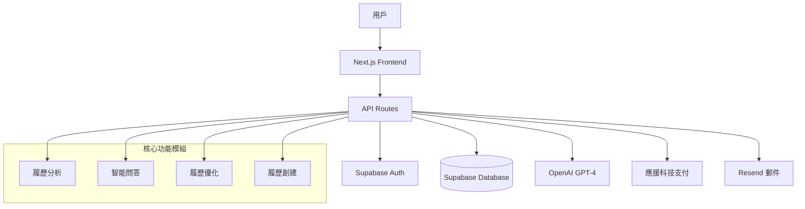

# RenderResume - 全面系統文檔

*AI 履歷生成器 - 系統架構、業務邏輯與使用手冊*

---

## 📋 目錄

1. [系統概覽](#系統概覽)
2. [系統架構](#系統架構)
3. [業務邏輯](#業務邏輯)
4. [核心功能](#核心功能)
5. [用戶手冊](#用戶手冊)
6. [管理員功能](#管理員功能)
7. [API 文檔](#api-文檔)
8. [部署指南](#部署指南)
9. [故障排除](#故障排除)

---

## 系統概覽

### 🎯 產品定位
RenderResume 是一個採用 AI 技術的專業履歷與作品集生成器，基於 Fortune 500 企業標準的六維度評估模型，運用 STAR 原則架構，協助求職者打造具有競爭力的履歷。

### ✨ 核心價值主張
- **AI 智能分析**: 使用 GPT-4 進行深度履歷分析
- **專業評分**: Fortune 500 企業標準的六維度評估
- **STAR 重構**: 自動將經歷重構為有說服力的 STAR 框架
- **智能問答**: 互動式優化建議與即時履歷改善
- **多語言支援**: 繁體中文與英文介面

### 📊 服務模式
- **免費用戶**: 基礎履歷分析功能
- **Pro 用戶**: 完整功能包含創建履歷、智能問答、無限制分析

---

## 系統架構

### 🛠 技術棧

#### 前端技術
- **框架**: Next.js 15 (App Router)
- **UI 庫**: React 19
- **樣式**: Tailwind CSS + Radix UI
- **狀態管理**: React Hooks + Context API
- **主題**: Light/Dark mode 支援

#### 後端技術
- **運行環境**: Node.js 18+
- **API**: Next.js API Routes
- **數據庫**: Supabase (PostgreSQL)
- **認證**: Supabase Auth
- **檔案存儲**: 本地文件處理

#### AI & 機器學習
- **主要模型**: OpenAI GPT-4o-mini
- **AI 框架**: LangChain
- **文件處理**: PDF.js, 圖片 OCR
- **語義搜索**: 向量相似度計算

#### 第三方整合
- **支付系統**: 應援科技 API
- **郵件服務**: Resend
- **部署平台**: Vercel

### 🏗 系統架構圖



### 📁 專案結構

```
render-resume/
├── app/                     # Next.js App Router
│   ├── (protected)/         # 需要認證的頁面
│   │   ├── dashboard/       # 儀表板
│   │   ├── analyze/         # 分析結果頁
│   │   ├── smart-chat/      # 智能問答
│   │   ├── subscription/    # 訂閱管理
│   │   └── profile/         # 用戶資料
│   ├── (static)/           # 靜態頁面
│   ├── admin/              # 管理員功能
│   ├── api/                # API 路由
│   └── auth/               # 認證相關頁面
├── components/             # React 組件
│   ├── analysis/           # 分析相關組件
│   ├── smart-chat/         # 智能問答組件
│   ├── ui/                 # 基礎 UI 組件
│   └── landing/            # 首頁組件
├── lib/                    # 核心邏輯
│   ├── api/                # API 客戶端
│   ├── auth/               # 認證邏輯
│   ├── config/             # 配置文件
│   ├── prompts/            # AI 提示模板
│   ├── supabase/           # 數據庫客戶端
│   └── types/              # TypeScript 類型
└── docs/                   # 文檔目錄
```

### 🔄 數據流架構

#### 用戶認證流程
1. **註冊/登入** → Supabase Auth
2. **Session 管理** → 中介軟體驗證
3. **權限檢查** → Pro 用戶驗證
4. **用戶同步** → 自動創建用戶記錄

#### 履歷分析流程
1. **文件上傳** → 本地處理 + OCR
2. **內容提取** → PDF.js / 圖片文字識別
3. **AI 分析** → OpenAI GPT-4 處理
4. **結果解析** → 結構化數據提取
5. **評分計算** → 六維度評分算法
6. **結果展示** → React 組件渲染

#### 支付訂閱流程
1. **方案選擇** → 前端方案展示
2. **支付創建** → 應援科技 API
3. **支付處理** → 第三方支付頁面
4. **回調處理** → 訂閱狀態更新
5. **權限激活** → Pro 功能解鎖

---

## 業務邏輯

### 🎯 六維度評分模型

RenderResume 採用基於 Fortune 500 企業標準的六維度評估模型，每個維度都有詳細的評分標準：

#### 1. 💻 技術深度與廣度 (25%)
- **A+ 等級**: 技術領域頂尖專家，引領技術趨勢
- **評估標準**: 掌握前瞻性技術、完整技術架構設計能力、跨技術棧整合能力
- **評分依據**: 技術棧廣度、架構設計經驗、創新技術應用

#### 2. 🚀 項目複雜度與影響力 (25%)
- **A+ 等級**: 主導企業級/產業級重大項目，具備顯著商業影響
- **評估標準**: 項目規模、技術挑戰、商業價值、創新突破
- **評分依據**: STAR 原則完整性、量化成果、影響範圍

#### 3. 💼 專業經驗完整度 (20%)
- **A+ 等級**: 職涯軌跡完美，具備戰略思維與卓越領導經驗
- **評估標準**: 職涯發展連貫性、管理經驗、專業深度
- **評分依據**: 工作經歷完整性、職位成長軌跡、責任範圍

#### 4. 🎓 教育背景與專業匹配度 (15%)
- **A+ 等級**: 頂尖學府背景，專業與職涯完美匹配
- **評估標準**: 學歷層次、專業相關性、持續學習能力
- **評分依據**: 教育機構聲譽、專業匹配度、學習成果

#### 5. 🏆 成果與驗證 (10%)
- **A+ 等級**: 具備業界認可的重大成就，有權威第三方驗證
- **評估標準**: 成就重要性、量化指標、外部認可
- **評分依據**: 獎項證書、量化成果、業界影響力

#### 6. ✨ 整體專業形象 (5%)
- **A+ 等級**: 履歷展現卓越的專業素養與強烈個人品牌
- **評估標準**: 履歷結構、表達能力、專業形象
- **評分依據**: 內容組織、語言表達、格式規範

### 📈 評分等級制度

採用 11 級等第制評分系統：

| 等級 | 分數範圍 | 標準描述 |
|------|----------|----------|
| A+ | 95-100% | 卓越表現，業界頂尖水準 |
| A | 90-94% | 優秀表現，高於平均水準 |
| A- | 85-89% | 良好表現，穩定優質水準 |
| B+ | 80-84% | 滿意表現，高於基準要求 |
| B | 75-79% | 合格表現，符合基準要求 |
| B- | 70-74% | 基本表現，接近基準要求 |
| C+ | 60-69% | 待改進，低於基準要求 |
| C | 50-59% | 需改進，明顯不足 |
| C- | 40-49% | 急需改進，嚴重不足 |
| F | 0-39% | 不合格，完全不符合要求 |

### ⭐ STAR 原則評估框架

系統採用 STAR 原則對項目經驗和工作成果進行評估：

#### S - Situation (情境) - 25%
- 識別項目背景、業務環境、技術挑戰
- 評估問題的複雜度和緊急性
- 分析當時的資源限制和約束條件

#### T - Task (任務) - 25%
- 明確候選人的具體職責和目標
- 評估任務的難度和重要性
- 分析任務與候選人角色的匹配度

#### A - Action (行動) - 25%
- 識別候選人採取的具體技術方案
- 評估解決方案的創新性和有效性
- 分析決策過程和執行能力

#### R - Result (結果) - 25%
- 量化項目成果和業務影響
- 評估技術成果的可持續性
- 分析對團隊和組織的貢獻

### 💰 定價與訂閱模式

#### 免費方案
- **功能限制**: 基礎履歷分析
- **使用限制**: 有限次數分析
- **支援內容**: 基本六維度評分

#### Pro 方案
- **價格**: NT$ 299/月
- **核心功能**: 
  - 無限制履歷分析
  - 智能問答優化
  - 履歷創建功能
  - STAR 重構服務
  - 優先客服支援
- **技術優勢**: 使用最新 GPT-4 模型

#### 企業方案
- **定制服務**: 企業批量分析
- **API 接入**: 系統整合支援
- **專屬服務**: 專業顧問支援

---

## 核心功能

### 📊 履歷分析功能

#### 支援格式
- **PDF 文件**: 完整文檔解析
- **圖片檔案**: OCR 文字識別
- **文字輸入**: 直接貼上內容
- **結構化表單**: 分段式資料輸入

#### 分析流程
1. **文件處理**: 自動提取文字內容
2. **內容解析**: AI 理解履歷結構
3. **資訊提取**: 識別關鍵履歷要素
4. **評分分析**: 六維度專業評估
5. **建議生成**: 具體改善建議

#### 輸出內容
- **六維度評分**: 詳細分數與等級
- **履歷摘要**: 各項目結構化整理
- **缺失分析**: 關鍵要素識別
- **改進建議**: 具體可執行建議
- **追問列表**: 互動式補充引導

### 💬 智能問答系統

#### 功能特色
- **上下文理解**: 基於履歷內容的智能對話
- **個性化建議**: 針對用戶履歷的專屬建議
- **即時優化**: 對話中即時優化履歷內容
- **建議模板**: 預設優化建議模板
- **STAR 重構**: 自動將經驗轉換為 STAR 格式

#### 對話流程
1. **問題理解**: AI 分析用戶問題意圖
2. **內容關聯**: 結合履歷分析結果
3. **建議生成**: 產生個性化改善建議
4. **互動引導**: 引導用戶補充關鍵資訊
5. **模板匹配**: 自動匹配相關建議模板

#### 建議類型
- **內容優化**: 履歷內容改寫建議
- **結構調整**: 履歷格式優化
- **技能補強**: 技術能力提升方向
- **經驗包裝**: STAR 原則重新組織
- **關鍵字優化**: ATS 系統友善調整

### 🔧 履歷優化功能

#### 優化類型
- **STAR 重構**: 將工作經驗重組為 STAR 格式
- **關鍵字優化**: 增強 ATS 系統相容性
- **內容精煉**: 提升表達的精準度和影響力
- **格式優化**: 改善視覺呈現和閱讀體驗
- **個性化調整**: 針對特定職位或公司的客製化

#### 優化流程
1. **需求分析**: 理解用戶優化目標
2. **內容審查**: 分析現有履歷內容
3. **建議選擇**: 用戶選擇優化方向
4. **AI 優化**: 自動生成優化版本
5. **結果呈現**: 對比展示優化效果

### 📝 履歷創建功能

#### 創建模式
- **從零開始**: 透過結構化表單建立履歷
- **範本引導**: 使用預設範本快速開始
- **AI 輔助**: 智能建議內容填寫
- **即時預覽**: 所見即所得編輯體驗

#### 輸入表單
- **個人資訊**: 基本聯絡資料
- **教育背景**: 學歷、成績、相關課程
- **工作經驗**: 職位、公司、職責、成就
- **專案經驗**: 項目描述、技術棧、成果
- **技能專長**: 技術技能、軟技能
- **其他連結**: LinkedIn、GitHub、作品集

---

## 用戶手冊

### 🚀 快速開始

#### 1. 帳號註冊與登入
1. **訪問網站**: 進入 RenderResume 首頁
2. **選擇註冊**: 點擊右上角「註冊」按鈕
3. **填寫資料**: 輸入電子郵件與密碼
4. **信箱驗證**: 檢查信箱並點擊驗證連結
5. **完成註冊**: 自動登入並進入儀表板

#### 2. 升級到 Pro 方案
1. **進入訂閱頁**: 點擊「升級」按鈕
2. **選擇方案**: 選擇 Pro 方案 (NT$ 299/月)
3. **完成支付**: 透過應援科技支付系統付款
4. **功能解鎖**: 支付完成後立即享有 Pro 功能

### 📋 履歷分析使用流程

#### 服務選擇
1. **進入儀表板**: 登入後自動進入主頁面
2. **選擇服務**: 點擊「開始創建」按鈕
3. **服務類型**: 
   - **創建履歷**: 從零開始建立履歷
   - **優化履歷**: 分析並改善現有履歷

#### 創建履歷流程
1. **結構化輸入**: 透過表單填寫履歷資訊
   - 個人資訊與聯絡方式
   - 教育背景與學歷
   - 工作經驗與職責
   - 專案經驗與成果
   - 技能專長與能力
2. **資料驗證**: 系統檢查必填欄位
3. **開始分析**: 系統自動進行 AI 分析
4. **檢視結果**: 查看詳細分析報告

#### 優化履歷流程
1. **文件上傳**: 選擇履歷文件格式
   - **PDF 檔案**: 拖拉上傳或點擊選擇
   - **圖片檔案**: 支援 JPG、PNG 格式
   - **文字輸入**: 直接貼上履歷內容
2. **額外資訊**: 提供補充說明（選填）
3. **開始分析**: 點擊「開始分析」按鈕
4. **等待處理**: AI 分析約需 30-60 秒
5. **檢視結果**: 自動跳轉到結果頁面

### 📊 分析結果解讀

#### 總分與等級
- **整體評分**: 六維度加權平均分數
- **等級標示**: A+ 到 F 的等第制評分
- **分數分布**: 各維度評分雷達圖
- **改善空間**: 重點提升方向建議

#### 六維度詳細分析
每個維度包含：
- **當前評分**: 具體等級與分數
- **評分理由**: Chain of Thought 推理過程
- **改善建議**: 具體可執行的提升方向
- **參考標準**: 對應等級的具體要求

#### 履歷內容解析
- **個人資料**: 提取的基本資訊
- **工作經驗**: 結構化的職業歷程
- **專案經驗**: 技術項目與成果
- **技能專長**: 技術棧與能力清單
- **教育背景**: 學歷與相關課程
- **成就獎項**: 認證與榮譽記錄

#### 缺失內容分析
- **關鍵缺失**: 重要履歷要素識別
- **建議補充**: 具體內容補強方向
- **影響分析**: 缺失對評分的影響程度
- **優先順序**: 改善建議的重要性排序
- **互動追問**: 5+ 個針對性補充問題

### 💬 智能問答使用指南

#### 啟動智能問答
1. **Pro 用戶驗證**: 確認 Pro 方案權限
2. **進入問答**: 從分析結果頁點擊「智能問答」
3. **對話界面**: 進入聊天室介面
4. **AI 歡迎**: 系統主動提供初始建議

#### 對話操作
- **文字輸入**: 在底部輸入框打字
- **發送訊息**: 點擊發送按鈕或按 Enter
- **快速回覆**: 點擊預設回覆選項
- **文件參考**: AI 會引用您的履歷內容
- **建議採納**: 可以接受或跳過 AI 建議

#### 對話技巧
- **具體問題**: 針對特定履歷項目提問
- **明確需求**: 說明想要改善的方向
- **提供細節**: 補充履歷中未包含的資訊
- **確認理解**: 確保 AI 正確理解您的需求

#### 建議管理
- **建議收集**: 對話中產生的優化建議會自動收集
- **建議預覽**: 可以隨時查看已收集的建議
- **建議選擇**: 選擇要應用的建議項目
- **批次優化**: 一次性應用多個建議

### 🔧 履歷優化功能

#### 建議選擇
1. **查看建議**: 在建議頁面瀏覽所有收集的建議
2. **詳細說明**: 每個建議都有詳細的說明與理由
3. **選擇應用**: 勾選想要應用的建議項目
4. **目標設定**: 可以指定目標職位或公司（選填）

#### 優化執行
1. **確認選擇**: 檢查已選擇的建議項目
2. **開始優化**: 點擊「開始優化」按鈕
3. **AI 處理**: 系統根據選擇的建議進行優化
4. **處理時間**: 通常需要 1-2 分鐘

#### 結果查看
- **優化內容**: 查看 AI 生成的優化履歷
- **對比檢視**: 原版與優化版的對比顯示
- **修改建議**: 進一步的調整建議
- **下載匯出**: 將優化結果匯出使用

### 👤 個人資料管理

#### 帳戶設定
- **基本資料**: 姓名、電子郵件修改
- **密碼變更**: 安全密碼更新
- **頭像設定**: 個人照片上傳
- **偏好設定**: 語言、主題選擇

#### 訂閱管理
- **方案資訊**: 查看當前訂閱狀態
- **使用統計**: 本月使用次數統計
- **續訂設定**: 自動續訂開關
- **發票記錄**: 付款歷史查詢

#### 隱私設定
- **資料安全**: 個人資料保護設定
- **分析記錄**: 履歷分析歷史管理
- **帳戶刪除**: 完全刪除帳戶功能

---

## 管理員功能

### 🏗 管理員系統架構

#### 權限管理
- **管理員識別**: 基於 UUID 的權限認證
- **角色分級**: 超級管理員、一般管理員、版主
- **功能權限**: 細分的功能模組訪問控制
- **安全驗證**: 雙重驗證機制

#### 管理員界面
- **統一導航**: 側邊欄導航設計
- **儀表板**: 系統概況與統計資料
- **響應式設計**: 支援多設備訪問

### 📊 系統監控與統計

#### 儀表板功能
- **用戶統計**: 
  - 總用戶數與成長趨勢
  - 活躍用戶數（日/週/月）
  - 新註冊用戶統計
  - 用戶留存率分析
- **訂閱統計**:
  - 免費 vs Pro 用戶比例
  - 訂閱收入統計
  - 續訂率分析
  - 取消訂閱原因
- **功能使用統計**:
  - 履歷分析次數
  - 智能問答使用率
  - 功能受歡迎程度
  - 系統效能指標

#### 實時監控
- **系統健康**: 服務運行狀態
- **API 效能**: 回應時間與錯誤率
- **資源使用**: CPU、記憶體、儲存空間
- **外部服務**: OpenAI、支付系統狀態

### 👥 用戶管理功能

#### 用戶列表
- **搜索過濾**: 按姓名、信箱、註冊時間搜索
- **用戶分類**: 免費用戶、Pro 用戶、停用用戶
- **批量操作**: 批量發送郵件、權限修改
- **詳細資料**: 用戶註冊資訊、使用記錄

#### 用戶操作
- **帳戶管理**: 
  - 重設密碼
  - 停用/啟用帳戶
  - 修改用戶資料
  - 查看登入記錄
- **訂閱管理**:
  - 手動升級/降級
  - 延長訂閱期限
  - 退款處理
  - 促銷碼發放

### 📧 郵件群發系統

#### 郵件模板
系統提供 5 種預設郵件模板：

1. **系統公告**: 系統更新、維護通知
2. **功能更新**: 新功能發布、產品更新
3. **優惠活動**: 促銷活動、特別優惠
4. **電子報**: 定期技巧分享、職涯建議
5. **自訂郵件**: 完全客製化內容

#### 收件人管理
- **用戶篩選**:
  - 所有用戶
  - 活躍用戶（30 天內登入）
  - 付費用戶（Pro 方案）
  - 免費用戶
- **搜索功能**: 按姓名或信箱搜索
- **批量選擇**: 全選、取消全選、逐個選擇

#### 郵件編輯
- **主旨設定**: 可修改預設主旨
- **內容編輯**: 
  - 預設模板可自訂內容覆蓋
  - 自訂模板需完整輸入內容
  - 支援 HTML 格式編輯
- **即時預覽**: 
  - 啟用即時預覽自動更新
  - 手動預覽彈窗檢視
  - 樣品用戶測試

#### 發送管理
- **發送設定**:
  - 確認收件人數量
  - 檢查郵件內容完整性
  - 設定發送時間（即時/排程）
- **批量發送機制**:
  - 每批 10 封郵件
  - 間隔 1 秒避免頻率限制
  - 即時發送狀態回報
- **結果統計**:
  - 成功發送數量
  - 失敗發送數量
  - 錯誤原因分析

### 📢 公告管理系統

#### 公告類型
- **資訊公告** (info): 一般資訊通知
- **警告公告** (warning): 重要注意事項
- **成功公告** (success): 正面訊息通知
- **錯誤公告** (error): 系統錯誤通知

#### 公告功能
- **新增公告**: 標題、內容、類型設定
- **編輯公告**: 修改現有公告內容
- **啟用/停用**: 控制公告顯示狀態
- **排序管理**: 公告顯示順序控制

#### 顯示控制
- **目標用戶**: 可設定特定用戶群顯示
- **顯示位置**: 系統頂部、側邊欄、彈窗
- **顯示時間**: 設定公告有效期限
- **關閉控制**: 用戶可關閉或強制顯示

### ⚙️ 系統設定管理

#### 一般設定
- **網站資訊**:
  - 網站名稱、描述
  - 聯絡信箱設定
  - 維護模式開關
- **功能控制**:
  - 開放註冊開關
  - OAuth 登入啟用
  - 用戶使用限制
  - 服務功能開關

#### 安全設定
- **認證設定**:
  - 最大登入嘗試次數
  - Session 超時時間
  - 信箱驗證要求
  - 雙重認證啟用
- **密碼政策**:
  - 最小密碼長度
  - 複雜度要求
  - 定期更換提醒

#### 郵件設定
- **SMTP 配置**:
  - 郵件伺服器設定
  - 認證資訊管理
  - 發送者資訊設定
- **郵件模板**:
  - 歡迎信件模板
  - 密碼重設模板
  - 通知信件格式

### 🧪 測試功能

#### 郵件測試
- **模板測試**: 測試各種郵件模板
- **發送測試**: 向指定信箱發送測試郵件
- **格式驗證**: 檢查郵件格式正確性
- **預覽功能**: 即時預覽郵件效果

#### 系統測試
- **API 端點測試**: 測試各 API 功能
- **資料庫連線測試**: 驗證資料庫狀態
- **第三方服務測試**: OpenAI、支付系統連線
- **效能測試**: 系統回應時間測試

---

## API 文檔

### 🔐 認證機制

#### Supabase Auth
- **JWT Token**: 使用 Supabase 提供的 JWT 認證
- **Session 管理**: 自動處理 token 刷新
- **權限驗證**: 基於用戶訂閱狀態的權限控制

#### API 認證流程
```typescript
// 認證中介軟體
export async function middleware(request: NextRequest) {
  // 1. 從 cookie 獲取 session
  // 2. 驗證 JWT token
  // 3. 檢查用戶訂閱狀態
  // 4. 返回認證結果
}
```

### 📋 API 端點總覽

#### 認證相關 API
- `POST /api/users/sync` - 用戶資料同步
- `GET /api/users/[id]` - 獲取用戶資料
- `PUT /api/users/[id]` - 更新用戶資料

#### 履歷分析 API
- `POST /api/analyze` - 履歷分析（支援文字、文件、批次）
- `GET /api/analyze/history` - 分析歷史記錄
- `GET /api/analyze/[id]` - 獲取特定分析結果

#### 智能問答 API
- `POST /api/smart-chat` - 智能問答對話
- `GET /api/smart-chat/history` - 對話歷史記錄
- `DELETE /api/smart-chat/session` - 清除對話記錄

#### 履歷優化 API
- `POST /api/optimize-resume` - 履歷優化處理
- `GET /api/optimize-resume/suggestions` - 獲取優化建議
- `POST /api/optimize-resume/apply` - 應用優化建議

#### 訂閱支付 API
- `POST /api/payment/checkout` - 創建支付
- `POST /api/payment/callback` - 支付回調
- `GET /api/subscriptions` - 獲取訂閱資訊
- `POST /api/redeem` - 兌換促銷碼

#### 管理員 API
- `GET /api/admin/auth` - 管理員權限驗證
- `GET /api/admin/dashboard` - 管理員儀表板數據
- `GET /api/admin/users` - 用戶管理
- `POST /api/admin/email/send` - 郵件群發
- `GET /api/admin/announcements` - 公告管理

### 📊 履歷分析 API

#### POST /api/analyze

**功能**: 履歷分析主要端點，支援多種輸入格式

**請求參數**:
```typescript
interface AnalyzeRequest {
  // 文字分析
  resume?: string;           // 履歷文字內容
  text?: string;            // 額外補充說明
  
  // 文件分析（FormData）
  files?: File[];           // 上傳的文件（PDF/圖片）
  
  // 結構化資料
  education?: Education[];   // 教育背景
  experience?: Experience[]; // 工作經驗
  projects?: Project[];      // 專案經驗
  skills?: string;          // 技能專長
  personalInfo?: PersonalInfo; // 個人資訊
  links?: Links;            // 相關連結
  
  // 服務類型
  serviceType?: 'create' | 'optimize'; // 服務模式
  useVision?: boolean;      // 是否使用視覺分析
}
```

**回應格式**:
```typescript
interface AnalyzeResponse {
  success: boolean;
  data: ResumeAnalysisResult;
  type: 'text_analysis' | 'file_analysis';
  processingTime?: number;
}

interface ResumeAnalysisResult {
  // 個人基本資料
  profile: {
    name?: string;
    title?: string;
    brief_introduction?: string;
    email?: string;
    phone?: string;
    location?: string;
    linkedin?: string;
    github?: string;
    website?: string;
    portfolio?: string;
  };
  
  // 專案經驗
  projects: Project[];
  projects_summary: string;
  
  // 技能專長
  expertise: string[];
  expertise_summary: string;
  
  // 工作經驗
  work_experiences: WorkExperience[];
  work_experiences_summary: string;
  
  // 教育背景
  education_background: Education[];
  education_summary: string;
  
  // 成就獎項
  achievements: Achievement[];
  achievements_summary: string;
  
  // 缺失內容分析
  missing_content: {
    critical_missing: string[];
    recommended_additions: string[];
    impact_analysis: string;
    priority_suggestions: string[];
    follow_ups: FollowUp[];
  };
  
  // 六維度評分
  scores: Score[];
}
```

### 💬 智能問答 API

#### POST /api/smart-chat

**功能**: 智能問答對話處理

**權限要求**: Pro 用戶

**請求參數**:
```typescript
interface ChatRequest {
  messages: ChatMessage[];         // 對話歷史
  analysisResult: ResumeAnalysisResult; // 履歷分析結果
  suggestions?: SuggestionRecord[]; // 已有建議
  templates?: SuggestionTemplate[]; // 建議模板
}

interface ChatMessage {
  type: 'user' | 'ai' | 'file';
  content: string;
  timestamp: Date;
  suggestion?: Suggestion;
  excerpt?: Excerpt;
}
```

**回應格式**:
```typescript
interface ChatResponse {
  success: boolean;
  data: {
    messages: ChatMessage[];      // AI 回應訊息
    cannedOptions: string[];      // 快速回覆選項
    templates: SuggestionTemplate[]; // 更新的建議模板
  };
}
```

### 🔧 履歷優化 API

#### POST /api/optimize-resume

**功能**: 根據選擇的建議優化履歷內容

**請求參數**:
```typescript
interface OptimizeRequest {
  analysisResult: ResumeAnalysisResult;  // 原始分析結果
  selectedSuggestions: OptimizationSuggestion[]; // 選擇的建議
  targetRole?: string;                   // 目標職位
  targetCompany?: string;               // 目標公司
}
```

**回應格式**:
```typescript
interface OptimizeResponse {
  success: boolean;
  data: {
    optimizedContent: string;     // 優化後的履歷內容
    changes: Change[];           // 具體變更記錄
    improvements: string[];      // 改善說明
  };
}
```

### 💳 支付訂閱 API

#### POST /api/payment/checkout

**功能**: 創建支付訂單

**請求參數**:
```typescript
interface CheckoutRequest {
  planId: number;              // 方案 ID
}
```

**回應格式**:
```typescript
interface CheckoutResponse {
  success: boolean;
  paymentUrl: string;          // 支付頁面 URL
  orderId: string;            // 訂單編號
}
```

#### POST /api/payment/callback

**功能**: 支付結果回調處理

**請求參數**:
```typescript
interface CallbackRequest {
  orderId: string;            // 訂單編號
  merchantId: string;         // 商戶 ID
  status: string;            // 支付狀態
  transactionId?: string;    // 交易 ID
}
```

### 🛡 錯誤處理

#### 統一錯誤格式
```typescript
interface ErrorResponse {
  success: false;
  error: string;              // 錯誤訊息
  code?: string;             // 錯誤代碼
  details?: any;             // 詳細錯誤資訊
  requiresAuth?: boolean;    // 是否需要認證
  requiresProPlan?: boolean; // 是否需要 Pro 方案
}
```

#### 常見錯誤代碼
- `AUTH_REQUIRED` - 需要登入認證
- `PRO_PLAN_REQUIRED` - 需要 Pro 方案
- `INVALID_INPUT` - 輸入參數錯誤
- `ANALYSIS_FAILED` - 分析處理失敗
- `PAYMENT_FAILED` - 支付處理失敗
- `SERVER_ERROR` - 伺服器內部錯誤

### 📈 API 使用限制

#### 免費用戶限制
- 履歷分析：每日 2 次
- 智能問答：不可使用
- 履歷優化：不可使用

#### Pro 用戶限制
- 履歷分析：每日 10 次（可根據方案調整）
- 智能問答：每次對話最多 50 輪
- 履歷優化：每日 10 次（可根據方案調整）

#### 使用限制檢查機制
- **即時檢查**: 每次 API 請求前都會檢查用戶當日使用量
- **自動阻擋**: 超過限制時自動返回 429 錯誤狀態碼
- **詳細回饋**: 提供當前使用量和限制資訊
- **方案升級提示**: 引導用戶升級方案以獲得更多額度

#### 技術限制
- 文件大小：最大 10MB
- 文件格式：PDF, JPG, PNG
- 請求超時：60 秒
- 並發限制：每用戶最多 3 個並發請求

---

## 部署指南

### 🌐 環境需求

#### 系統需求
- **Node.js**: 18.0 或更高版本
- **包管理器**: pnpm（推薦）或 npm
- **瀏覽器**: 現代瀏覽器支援

#### 外部服務依賴
- **Supabase**: 資料庫與認證服務
- **OpenAI**: AI 分析引擎
- **應援科技**: 支付處理服務
- **Resend**: 郵件發送服務
- **Vercel**: 部署平台（推薦）

### 📋 環境變數配置

#### 必要環境變數
```env
# OpenAI 配置
OPENAI_API_KEY=your_openai_api_key_here
OPENAI_MODEL=gpt-4o-mini
OPENAI_TEMPERATURE=0.3

# Supabase 配置
NEXT_PUBLIC_SUPABASE_URL=your_supabase_url
NEXT_PUBLIC_SUPABASE_ANON_KEY=your_supabase_anon_key
SUPABASE_SERVICE_ROLE_KEY=your_service_role_key

# 支付系統配置
PAYMENT_API_BASE=https://payment-api.testing.oen.tw
PAYMENT_API_TOKEN=your_payment_api_token
MERCHANT_ID=your_merchant_id

# 郵件服務配置
RESEND_API_KEY=your_resend_api_key
FROM_EMAIL=RenderResume <noreply@yourdomain.com>
SEND_EMAIL_HOOK_SECRET=v1,whsec_...

# 應用配置
NEXT_PUBLIC_APP_URL=http://localhost:3000
```

### 🚀 本地開發環境設置

#### 1. 專案複製與安裝
```bash
# 複製專案
git clone https://github.com/ruby0322/render-resume.git
cd render-resume

# 安裝依賴
pnpm install

# 複製環境變數範本
cp .env.example .env.local
```

#### 2. 環境變數設定
編輯 `.env.local` 文件，填入所需的環境變數值

#### 3. 資料庫設置
```bash
# 登入 Supabase CLI
supabase login

# 初始化本地專案
supabase init

# 啟動本地 Supabase 服務
supabase start

# 執行資料庫遷移
supabase db push
```

#### 4. 啟動開發伺服器
```bash
# 啟動開發模式
pnpm dev

# 或使用其他包管理器
npm run dev
yarn dev
```

#### 5. 訪問應用
- **前端**: http://localhost:3000
- **API**: http://localhost:3000/api
- **Supabase Studio**: http://localhost:54323

### 🏗 生產環境部署

#### Vercel 部署（推薦）

1. **連接 Git 倉庫**
   - 在 Vercel 中連接您的 GitHub 倉庫
   - 選擇 `render-resume` 專案

2. **環境變數配置**
   - 在 Vercel 專案設定中添加所有必要的環境變數
   - 確保生產環境 URL 正確設定

3. **部署設定**
   ```json
   {
     "buildCommand": "pnpm build",
     "outputDirectory": ".next",
     "installCommand": "pnpm install",
     "framework": "nextjs"
   }
   ```

4. **自動部署**
   - 推送到主分支自動觸發部署
   - 預覽分支提供測試環境

#### 其他平台部署

##### Docker 部署
```dockerfile
FROM node:18-alpine
WORKDIR /app
COPY package*.json ./
RUN npm ci --only=production
COPY . .
RUN npm run build
EXPOSE 3000
CMD ["npm", "start"]
```

##### 傳統主機部署
```bash
# 建置專案
pnpm build

# 啟動生產服務
pnpm start

# 使用 PM2 管理進程
pm2 start ecosystem.config.js
```

### 🔧 資料庫設置詳細指南

#### Supabase 專案設置

1. **創建 Supabase 專案**
   - 訪問 https://supabase.com
   - 創建新專案
   - 記錄專案 URL 和 API 金鑰

2. **資料表創建**
   執行以下 SQL 腳本創建必要的資料表：

```sql
-- 用戶表
CREATE TABLE users (
  id UUID REFERENCES auth.users ON DELETE CASCADE,
  email TEXT UNIQUE NOT NULL,
  display_name TEXT,
  avatar_url TEXT,
  created_at TIMESTAMP WITH TIME ZONE DEFAULT NOW(),
  updated_at TIMESTAMP WITH TIME ZONE,
  welcome_email_sent BOOLEAN DEFAULT FALSE,
  PRIMARY KEY (id)
);

-- 方案表
CREATE TABLE plans (
  id SERIAL PRIMARY KEY,
  title TEXT,
  type TEXT,
  price INTEGER,
  duration_days INTEGER,
  daily_usage INTEGER DEFAULT 0,
  created_at TIMESTAMP WITH TIME ZONE DEFAULT NOW()
);

-- 訂閱表
CREATE TABLE subscriptions (
  id SERIAL PRIMARY KEY,
  user_id UUID REFERENCES users(id) ON DELETE CASCADE,
  plan_id INTEGER REFERENCES plans(id) ON DELETE CASCADE,
  is_active BOOLEAN DEFAULT TRUE,
  expire_at TIMESTAMP WITH TIME ZONE,
  order_id TEXT REFERENCES orders(order_id),
  created_at TIMESTAMP WITH TIME ZONE DEFAULT NOW()
);

-- 訂單表
CREATE TABLE orders (
  id SERIAL PRIMARY KEY,
  order_id TEXT UNIQUE NOT NULL,
  user_id UUID REFERENCES users(id) ON DELETE CASCADE,
  plan_id INTEGER REFERENCES plans(id),
  amount INTEGER,
  status TEXT DEFAULT 'pending',
  transaction_id TEXT,
  created_at TIMESTAMP WITH TIME ZONE DEFAULT NOW()
);

-- 促銷碼表
CREATE TABLE promo_codes (
  id SERIAL PRIMARY KEY,
  code TEXT UNIQUE,
  plan_id INTEGER REFERENCES plans(id) ON DELETE CASCADE,
  single_use BOOLEAN DEFAULT TRUE,
  redeemed_by UUID REFERENCES users(id),
  expire_date TIMESTAMP WITH TIME ZONE,
  created_at TIMESTAMP WITH TIME ZONE DEFAULT NOW()
);

-- 公告表
CREATE TABLE announcements (
  id SERIAL PRIMARY KEY,
  title TEXT NOT NULL,
  content TEXT,
  type announcement_type NOT NULL,
  is_active BOOLEAN DEFAULT TRUE,
  created_at TIMESTAMP WITH TIME ZONE DEFAULT NOW()
);

-- 管理員表
CREATE TABLE admins (
  user_id UUID REFERENCES users(id) ON DELETE CASCADE,
  PRIMARY KEY (user_id)
);
```

3. **權限設置 (RLS)**
   為每個表設置適當的 Row Level Security 政策

4. **函數創建**
   創建促銷碼兌換函數等必要的資料庫函數

### 🔐 安全性配置

#### API 金鑰管理
- 使用環境變數儲存敏感資訊
- 定期輪換 API 金鑰
- 限制 API 金鑰權限範圍

#### 資料庫安全
- 啟用 Row Level Security
- 設置適當的資料庫權限
- 定期備份資料庫

#### 應用安全
- 使用 HTTPS 連線
- 設置 CSP 標頭
- 實施速率限制
- 輸入驗證與清理

### 📊 監控與維護

#### 效能監控
- **Vercel Analytics**: 頁面載入時間監控
- **Supabase Monitoring**: 資料庫效能監控
- **OpenAI Usage**: API 使用量監控
- **應用日誌**: 錯誤追蹤與除錯

#### 定期維護
- **依賴更新**: 定期更新套件版本
- **安全補丁**: 及時應用安全更新
- **資料庫維護**: 定期清理與優化
- **備份策略**: 自動化資料備份

#### 監控指標
- **系統可用性**: 99.9% 正常運行時間
- **API 回應時間**: < 2 秒平均回應
- **錯誤率**: < 1% API 錯誤率
- **用戶滿意度**: 回饋與評分監控

---

## 故障排除

### 🔧 常見問題與解決方案

#### 認證相關問題

**問題**: 用戶無法登入
- **可能原因**: 
  - Supabase 配置錯誤
  - JWT token 過期
  - 網路連線問題
- **解決方案**:
  ```bash
  # 檢查 Supabase 連線
  supabase status
  
  # 驗證環境變數
  echo $NEXT_PUBLIC_SUPABASE_URL
  echo $NEXT_PUBLIC_SUPABASE_ANON_KEY
  
  # 清除瀏覽器快取
  localStorage.clear()
  ```

**問題**: Pro 用戶權限無法識別
- **可能原因**:
  - 訂閱記錄不正確
  - 權限檢查邏輯錯誤
  - 資料庫同步問題
- **解決方案**:
  ```sql
  -- 檢查用戶訂閱狀態
  SELECT u.email, s.is_active, s.expire_at, p.type
  FROM users u
  LEFT JOIN subscriptions s ON u.id = s.user_id
  LEFT JOIN plans p ON s.plan_id = p.id
  WHERE u.email = 'user@example.com';
  ```

#### AI 分析問題

**問題**: 履歷分析失敗
- **可能原因**:
  - OpenAI API 配額不足
  - 文件格式不支援
  - 網路連線問題
  - 系統負載過高
- **解決方案**:
  ```typescript
  // 檢查 OpenAI API 狀態
  const response = await fetch('https://api.openai.com/v1/models', {
    headers: {
      'Authorization': `Bearer ${process.env.OPENAI_API_KEY}`
    }
  });
  
  // 檢查配額使用情況
  console.log('API Usage:', response.headers.get('openai-usage'));
  ```

**問題**: 分析結果不完整
- **可能原因**:
  - AI 模型回應格式錯誤
  - JSON 解析失敗
  - 提示詞設計問題
- **解決方案**:
  - 檢查 AI 回應的原始內容
  - 驗證 JSON 格式有效性
  - 調整提示詞結構

#### 支付系統問題

**問題**: 支付回調失敗
- **可能原因**:
  - 回調 URL 配置錯誤
  - 商戶 ID 不匹配
  - 訂單狀態更新失敗
- **解決方案**:
  ```typescript
  // 檢查回調配置
  console.log('Callback URL:', process.env.NEXT_PUBLIC_APP_URL + '/api/payment/callback');
  console.log('Merchant ID:', process.env.MERCHANT_ID);
  
  // 手動更新訂單狀態
  await supabase
    .from('orders')
    .update({ status: 'paid' })
    .eq('order_id', orderId);
  ```

#### 資料庫連線問題

**問題**: Supabase 連線失敗
- **可能原因**:
  - 資料庫服務停止
  - 連線限制達到上限
  - 網路防火牆阻擋
- **解決方案**:
  ```bash
  # 檢查 Supabase 服務狀態
  curl -I https://your-project.supabase.co/rest/v1/
  
  # 測試資料庫連線
  supabase db ping
  
  # 重啟本地服務
  supabase stop
  supabase start
  ```

### 🚨 緊急處理程序

#### 系統全面停機
1. **立即行動**:
   - 檢查 Vercel 部署狀態
   - 驗證外部服務可用性
   - 通知用戶服務中斷
2. **問題診斷**:
   - 查看部署日誌
   - 檢查資料庫連線
   - 驗證 API 回應
3. **恢復服務**:
   - 回滾到穩定版本
   - 修復關鍵問題
   - 逐步恢復功能

#### 資料安全事件
1. **immediate Response**:
   - 隔離受影響系統
   - 保護敏感資料
   - 記錄事件詳情
2. **影響評估**:
   - 確定受影響範圍
   - 評估資料洩露風險
   - 準備用戶通知
3. **修復與預防**:
   - 修補安全漏洞
   - 強化安全措施
   - 更新安全政策

### 📊 效能優化建議

#### 前端優化
- **代碼分割**: 使用 Next.js 動態導入
- **圖片優化**: 使用 Next.js Image 組件
- **快取策略**: 實施適當的瀏覽器快取
- **懶加載**: 延遲載入非關鍵資源

#### 後端優化
- **資料庫索引**: 為查詢欄位建立索引
- **查詢優化**: 減少 N+1 查詢問題
- **快取層**: 實施 Redis 快取
- **API 限流**: 防止 API 濫用

#### AI 處理優化
- **批次處理**: 合併多個 AI 請求
- **結果快取**: 快取重複分析結果
- **並發控制**: 限制並發 AI 請求數量
- **錯誤重試**: 實施智能重試機制

### 📝 日誌與監控

#### 日誌收集
```typescript
// 結構化日誌格式
interface LogEntry {
  timestamp: Date;
  level: 'info' | 'warn' | 'error';
  service: string;
  action: string;
  userId?: string;
  data?: any;
  error?: Error;
}

// 日誌記錄範例
logger.info('Resume analysis started', {
  userId: user.id,
  fileType: 'pdf',
  fileSize: file.size
});
```

#### 關鍵指標監控
- **用戶體驗指標**:
  - 頁面載入時間
  - API 回應時間
  - 錯誤率統計
- **業務指標**:
  - 分析完成率
  - 用戶轉換率
  - 訂閱續費率
- **技術指標**:
  - 系統可用性
  - 資源使用率
  - 第三方服務狀態

---

## 📚 附錄

### 🔗 相關連結
- **GitHub 倉庫**: https://github.com/ruby0322/render-resume
- **官方網站**: https://render-resume.com
- **技術支援**: info@render-resume.com

### 📖 技術文檔參考
- **Next.js 文檔**: https://nextjs.org/docs
- **Supabase 文檔**: https://supabase.com/docs
- **OpenAI API 文檔**: https://platform.openai.com/docs
- **Tailwind CSS 文檔**: https://tailwindcss.com/docs

### 🏷 版本記錄
- **v1.0.0** (2024-01): 初始版本發布
- **v1.1.0** (2024-02): 智能問答功能上線
- **v1.2.0** (2024-03): 管理員系統完善
- **v1.3.0** (2024-04): 支付系統整合

### 📄 授權資訊
本系統採用 MIT 授權條款，詳細條款請參考 LICENSE 文件。