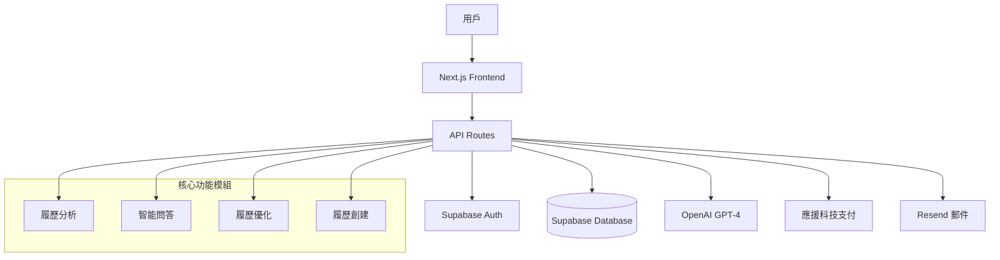
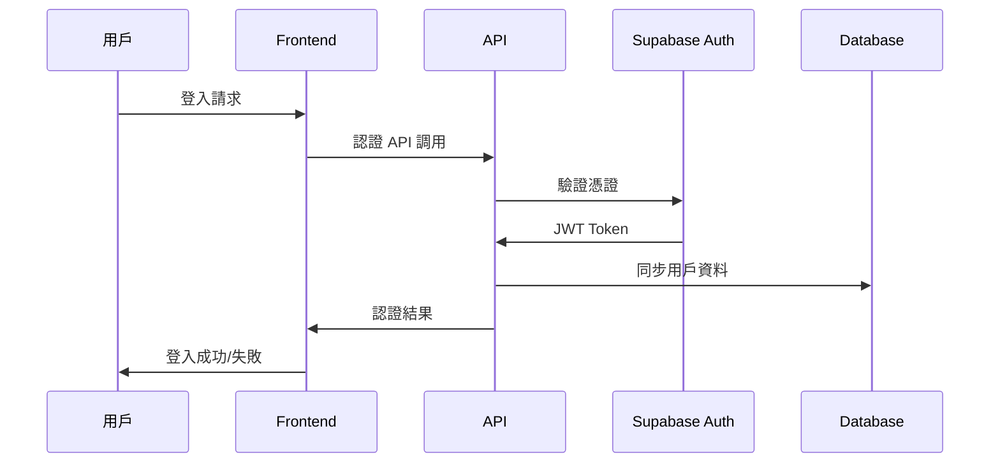
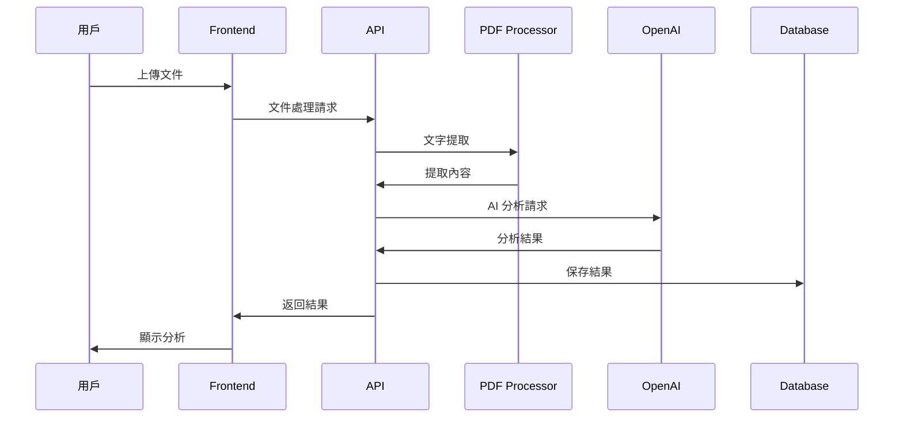
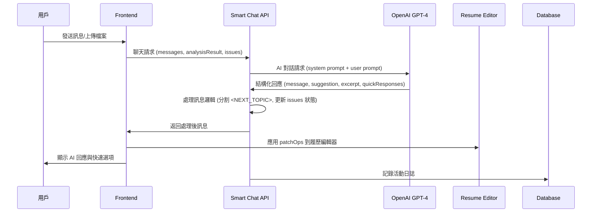
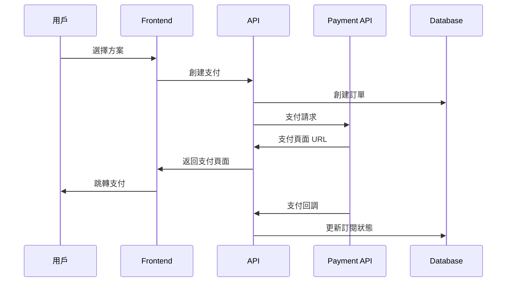
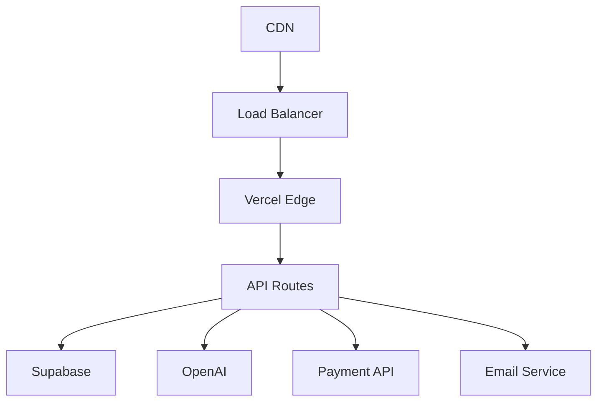

# RenderResume - 系統架構文檔

*AI 履歷編輯器 - 技術架構與系統設計*

---

## 📋 目錄

1. [技術棧概覽](#技術棧概覽)
2. [系統架構圖](#系統架構圖)
3. [專案結構](#專案結構)
4. [數據流架構](#數據流架構)
5. [安全性設計](#安全性設計)
6. [部署架構](#部署架構)

---

## 技術棧概覽

### 🛠 前端技術
- **框架**: Next.js 15 (App Router)
- **UI 庫**: React 19
- **樣式**: Tailwind CSS + Radix UI
- **狀態管理**: React Hooks + Context API
- **主題**: Light/Dark mode 支援

### 🔧 後端技術
- **運行環境**: Node.js 18+
- **API**: Next.js API Routes
- **數據庫**: Supabase (PostgreSQL)
- **認證**: Supabase Auth
- **檔案存儲**: 本地文件處理

### 🤖 AI & 機器學習
- **主要模型**: OpenAI gpt-4o-mini
- **AI 框架**: LangChain
- **文件處理**: PDF.js, 圖片 OCR
- **語義搜索**: 向量相似度計算

### 🔗 第三方整合
- **支付系統**: 應援科技 API
- **郵件服務**: Resend
- **部署平台**: Vercel

---

## 系統架構圖



### 🔄 組件互動流程

1. **用戶請求** → Next.js Frontend
2. **路由處理** → App Router
3. **API 調用** → API Routes
4. **業務邏輯** → 核心功能模組
5. **數據處理** → Supabase Database
6. **AI 分析** → OpenAI API
7. **結果返回** → 用戶界面

---

## 專案結構

```
render-resume/
├── app/                     # Next.js App Router
│   ├── (protected)/         # 需要認證的頁面
│   │   ├── dashboard/       # 儀表板
│   │   ├── analyze/         # 分析結果頁
│   │   ├── smart-chat/      # 智能問答
│   │   ├── subscription/    # 訂閱管理
│   │   └── profile/         # 用戶資料
│   ├── (static)/           # 靜態頁面
│   ├── admin/              # 管理員功能
│   ├── api/                # API 路由
│   └── auth/               # 認證相關頁面
├── components/             # React 組件
│   ├── analysis/           # 分析相關組件
│   ├── smart-chat/         # 智能問答組件
│   ├── ui/                 # 基礎 UI 組件
│   └── landing/            # 首頁組件
├── lib/                    # 核心邏輯
│   ├── api/                # API 客戶端
│   ├── auth/               # 認證邏輯
│   ├── config/             # 配置文件
│   ├── prompts/            # AI 提示模板
│   ├── supabase/           # 數據庫客戶端
│   └── types/              # TypeScript 類型
└── docs/                   # 文檔目錄
```

### 📁 核心目錄說明

#### `/app` - Next.js App Router
- **`(protected)/`**: 需要用戶認證的頁面
- **`(static)/`**: 公開的靜態頁面
- **`admin/`**: 管理員專用功能
- **`api/`**: REST API 端點
- **`auth/`**: 認證相關頁面

#### `/components` - React 組件
- **`analysis/`**: 履歷分析相關組件
- **`smart-chat/`**: 智能問答組件
- **`ui/`**: 可重用的基礎 UI 組件
- **`landing/`**: 首頁相關組件

#### `/lib` - 核心業務邏輯
- **`api/`**: API 客戶端與整合
- **`auth/`**: 認證與權限管理
- **`config/`**: 系統配置
- **`prompts/`**: AI 提示詞模板
- **`supabase/`**: 數據庫操作
- **`types/`**: TypeScript 類型定義

---

## 數據流架構

### 🔐 用戶認證流程



#### 認證步驟詳解
1. **用戶登入** → Supabase Auth 驗證
2. **Session 管理** → 中介軟體驗證
3. **權限檢查** → Pro 用戶驗證
4. **用戶同步** → 自動創建用戶記錄

### 📊 履歷分析流程



#### 分析步驟詳解
1. **文件上傳** → 本地處理 + OCR
2. **內容提取** → PDF.js / 圖片文字識別
3. **AI 分析** → OpenAI GPT-4 處理
4. **結果解析** → 結構化數據提取
5. **評分計算** → 六維度評分算法
6. **結果展示** → React 組件渲染

### 🤖 Smart Chat 智能問答流程



#### Smart Chat 核心特性

##### 1. AI 角色系統
- **Remo 博士**: 企鵝履歷顧問，專業且親切的溝通風格
- **STAR 原則**: 基於情境、任務、行動、成果進行深度追問
- **個性化稱呼**: 根據用戶姓名和職位提供適當稱呼

##### 2. 對話狀態管理
- **Issues 系統**: 管理進行中 (in_progress)、待處理 (pending)、已完成 (completed) 的問題
- **話題切換**: 使用 `<NEXT_TOPIC>` token 控制話題轉換
- **狀態同步**: excerpt 觸發 in_progress，suggestion 觸發 completed

##### 3. 結構化回應格式
```typescript
interface ChatResponse {
  message: string;                    // AI 回覆內容
  suggestion?: {                     // 履歷優化建議
    title: string;
    description: string;
    category: string;
    patchOps?: PatchOp[];            // 具體修改操作
  };
  quickResponses: string[];          // 快速回覆選項
  excerpt?: {                       // 履歷段落摘錄
    title: string;
    content: string;
    source: string;
    issue_id?: string;
  };
}
```

##### 4. 履歷整合機制
- **PatchOps 系統**: 提供 set/insert/remove 操作直接修改履歷
- **即時同步**: 建議可立即應用到履歷編輯器
- **差異追蹤**: 記錄用戶對履歷的實際修改

##### 5. 檔案上傳支援
- **多格式支援**: 圖片、PDF 檔案上傳
- **視覺分析**: 使用 GPT-4 Vision 進行圖片內容分析
- **檔案管理**: 自動處理檔案預覽和清理

#### Smart Chat 組件架構

```
components/smart-chat/
├── smart-chat.tsx              # 主聊天組件
├── desktop-chat-panel.tsx       # 桌面版聊天面板
├── mobile-chat-panel.tsx       # 手機版聊天面板
├── chat-message-card.tsx       # 訊息卡片組件
├── chat-input.tsx              # 聊天輸入框
├── canned-messages.tsx         # 快速回覆選項
├── ai-suggestions-sidebar.tsx  # AI 建議側邊欄
├── issue-bar.tsx              # 問題狀態條
├── use-chat-logic.ts          # 聊天邏輯 Hook
├── hooks.ts                   # 各種自定義 Hooks
└── types.ts                  # TypeScript 類型定義
```

#### Smart Chat 對話階段

1. **[STAGE:TOPIC_INTEREST]** 話題興趣確認
2. **[STAGE:TOPIC_OPEN]** 主題開啟（產生 excerpt）
3. **[STAGE:FOLLOWUP]** 深入追問（STAR 原則）
4. **[STAGE:INFO_CHECK]** 資訊補全檢查
5. **[STAGE:SUGGESTION]** 建議產生（產生 suggestion）
6. **[STAGE:TOPIC_TRANSITION]** 話題切換（插入 <NEXT_TOPIC>）

### 💳 支付訂閱流程



#### 支付步驟詳解
1. **方案選擇** → 前端方案展示
2. **支付創建** → 應援科技 API
3. **支付處理** → 第三方支付頁面
4. **回調處理** → 訂閱狀態更新
5. **權限激活** → Pro 功能解鎖

---

## 安全性設計

### 🔐 認證安全

#### JWT Token 管理
- **Token 存儲**: 安全的 HttpOnly Cookie
- **Token 刷新**: 自動刷新機制
- **過期處理**: 自動登出與重定向

#### 權限控制
```typescript
// 用戶權限檢查
export async function requireProUser(): Promise<AuthResult> {
  const { user, isAuthenticated } = await getAuthenticatedUser();
  
  if (!isAuthenticated) {
    return { isAuthenticated: false, isProUser: false };
  }
  
  const isProUser = user?.currentPlan?.type?.toLowerCase() === 'pro';
  return { isAuthenticated: true, isProUser };
}
```

### 🛡 API 安全

#### 速率限制
- **請求限制**: 每分鐘最多 60 次請求
- **文件上傳**: 最大 10MB 文件大小
- **並發控制**: 每用戶最多 3 個並發請求

#### 輸入驗證
```typescript
// API 輸入驗證
export async function validateAnalyzeRequest(body: any) {
  if (!body.resume && !body.files) {
    throw new Error('缺少履歷內容或文件');
  }
  
  if (body.files && body.files.length > 5) {
    throw new Error('文件數量超過限制');
  }
}
```

### 🔒 數據安全

#### 數據庫安全
- **Row Level Security**: 用戶數據隔離
- **SQL 注入防護**: 參數化查詢
- **敏感數據加密**: 密碼與個人資料加密

#### 文件安全
- **文件類型驗證**: 只允許安全文件格式
- **文件大小限制**: 防止大文件攻擊
- **臨時文件清理**: 自動清理上傳文件

---

## 部署架構

### 🌐 生產環境架構



### 🚀 部署選項

#### Vercel 部署（推薦）
- **自動部署**: Git 推送觸發部署
- **邊緣函數**: 全球 CDN 加速
- **環境管理**: 多環境配置
- **監控整合**: 內建效能監控

#### Docker 部署
```dockerfile
FROM node:18-alpine
WORKDIR /app
COPY package*.json ./
RUN npm ci --only=production
COPY . .
RUN npm run build
EXPOSE 3000
CMD ["npm", "start"]
```

#### 傳統主機部署
- **PM2 管理**: 進程管理與重啟
- **Nginx 反向代理**: 負載均衡
- **SSL 證書**: HTTPS 加密
- **防火牆配置**: 安全防護

### 📊 效能優化

#### 前端優化
- **代碼分割**: 動態導入組件
- **圖片優化**: Next.js Image 組件
- **快取策略**: 瀏覽器快取配置
- **懶加載**: 非關鍵資源延遲載入

#### 後端優化
- **資料庫索引**: 查詢效能優化
- **API 快取**: Redis 快取層
- **並發控制**: 請求隊列管理
- **錯誤重試**: 智能重試機制

### 🔧 監控與日誌

#### 關鍵指標
- **系統可用性**: 99.9% 正常運行時間
- **API 回應時間**: < 2 秒平均回應
- **錯誤率**: < 1% API 錯誤率
- **用戶滿意度**: 回饋與評分監控

#### 日誌收集
```typescript
interface LogEntry {
  timestamp: Date;
  level: 'info' | 'warn' | 'error';
  service: string;
  action: string;
  userId?: string;
  data?: any;
  error?: Error;
}
```

---

## 📚 相關文檔

- [業務邏輯文檔](./business-logic.md)
- [API 文檔](./api-documentation.md)
- [部署指南](./deployment-guide.md)
- [用戶手冊](./user-manual.md)